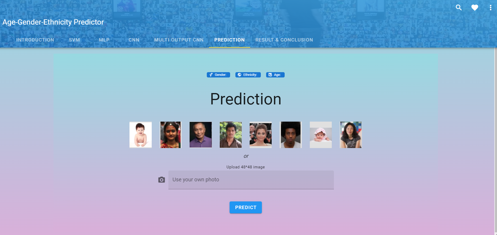
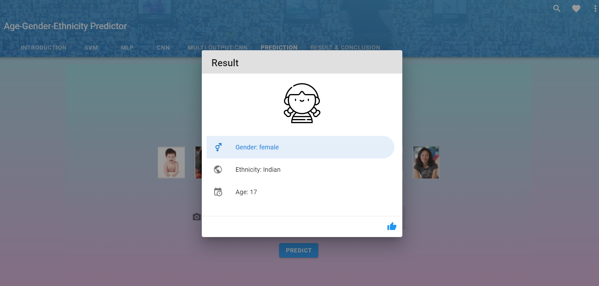
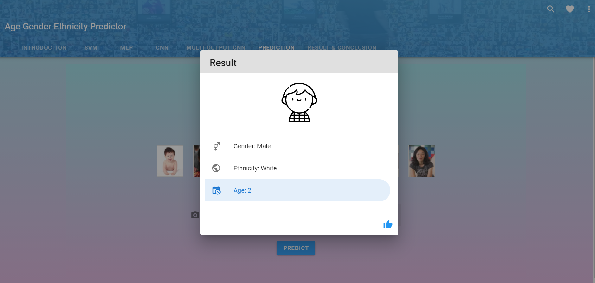

# 
 Age gender and ethnicity prediction 

## 
 Machine_learning_Project 

Web and Machine learning model
Problem statement was to predict the age gender and ethnicity of UTK face image dataset.
All the details of different types of models tried along with their results is shown in this [link](https://ritikajha.github.io/Machine_learning_Project/).

We have a folder named Python code, which contains all the code, saved models, images, the Kaggle downloaded dataset and the preprocessed dataset.

- all_saved_models - 
	This folder has all the saved models - MLP, CNN, SVM and multi utput CNN.
	
- dataset - 
	This folder has the dataset, that has been downloaded from Kaggle-Nipun arora :
	and also the preprocessed data

- images_all - 
	This folder has all the images - of architecture diagram, of the confusion matrix and of the training history plots.
	
- svm - 
	This folder has the python code for SVM model.
	
- demo_images_new - 
	This folder has the images that are used for demo in the website.
	

We have another folder name Web which contain Frontend and Backend which is developed in Flask and VueJS

Since predcition tab isnt working in website we have given some snapshots below.

Selecting a image over for which prediction will take place using CNN

Prediction on first image

Prediction on second image

## 
Please star the repository if it helped you 😊

